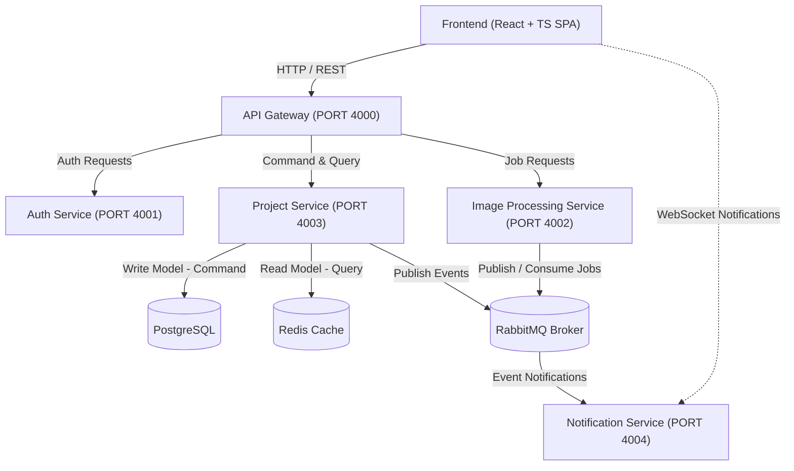

# PixPro

PixPro is an AI image processing platform built with distributed microservices.

[](https://www.typescriptlang.org/)
[](https://reactjs.org/)
[](https://nodejs.org/)
[](https://expressjs.com/)
[](https://nestjs.com/)
[](https://www.postgresql.org/)
[](https://redis.io/)
[](https://www.rabbitmq.com/)
[](https://www.docker.com/)
[](https://prometheus.io/)

---

## Key Features & Highlights

- **Scalable Microservices Architecture**: Decoupled, dedicated services orchestrated behind a unified API Gateway.
- **Asynchronous Event-Driven Processing**: Non-blocking job management powered by RabbitMQ message broker.
- **CQRS Pattern Implementation**: Dedicated PostgreSQL write models (Commands) and high-speed Redis read models (Queries).
- **Real-Time Communication**: WebSocket channel broadcasting live job status updates to the client.
- **Enterprise Resilience & Observability**: Integrated Circuit Breaker, Correlation ID tracking, and Prometheus metrics monitoring.
- **DevOps Ready**: Multi-container setup with Docker Compose, Swarm deployment capabilities, and GitLab CI/CD integration.

---

## Architecture Overview



### Microservices Breakdown

- `front`: React SPA that consumes the API Gateway and subscribes to real-time WebSocket updates.
- `api-gateway`: Single entry point for clients, routing requests and orchestrating downstream microservices.
- `auth-service`: NestJS authentication service boundary.
- `image-processing-service`: Asynchronous queue worker pipeline for image generation and event publication.
- `project-service`: CQRS implementation for project management (PostgreSQL for write commands, Redis for read queries).
- `notification-service`: Real-time notification hub utilizing WebSockets.
- `shared`: Reusable contracts for events, CQRS base structures, middleware, and logging.

---

## Key Architectural Concepts

- **CQRS (Command Query Responsibility Segregation)**: `project-service` separates write commands (persisted directly in PostgreSQL) from query reads (optimized with high-speed Redis cache).
- **Event-Driven Architecture (EDA)**: Asynchronous tasks like image processing request jobs are published to RabbitMQ topics, allowing services to scale independently.
- **Circuit Breaker & Distributed Tracing**: Integrated circuit breaking via Opossum to prevent cascading failures, centralized correlation IDs for distributed tracing, and Prometheus metrics collection.
- **Real-Time WebSockets**: Dynamic status updates pushed instantly to clients via `notification-service`.

---

## Project Structure

```text
pixpro/
|-- front/                        # React SPA Frontend
|-- back/                         # Microservices Backend
|   |-- api-gateway/              # Express API Gateway
|   |-- auth-service/             # NestJS Auth Service
|   |-- image-processing-service/ # Queue & Job Processing
|   |-- project-service/          # CQRS Projects Service
|   |-- notification-service/     # WebSocket Notifications
|   `-- shared/                   # Common Libraries & Bus Contracts
|-- docs/                         # Architecture Specs & Diagrams
|-- observability/                # Prometheus Config
|-- docker-compose.yml
|-- docker-stack.yml
`-- README.md
```

---

## CQRS + Message Broker Delivery

The activity deliverables are located in:

- Main PDF-ready document: `docs/ATIVIDADE_1_CQRS_MESSAGE_BROKER.md`
- Structurizr DSL diagram: `docs/diagrams/cqrs-message-broker.dsl`
- Test evidence: `docs/evidence/test-output.txt`

Implemented flows:

- `POST /projects`: Synchronous CQRS command, writes to PostgreSQL and publishes `project.created`.
- `POST /projects/commands`: Asynchronous `project.create` command through RabbitMQ.
- `GET /projects` and `GET /projects/:id`: High-speed queries served from Redis read model.
- `POST /images/jobs`: Publishes `image.process.requested`, consumed through RabbitMQ and converted into image events.

---

## Run With Docker

### Prerequisites

- Docker Desktop (or Docker Engine + Compose v2)

### Start

```bash
docker compose up --build
```

### Deploy with Docker Swarm (Local)

For local testing with Swarm:

```bash
docker stack deploy -c docker-stack.yml pixpro
```

### Main Endpoints

- **Frontend**: `http://localhost:5173`
- **API Gateway**: `http://localhost:4000/health`
- **Auth Service**: `http://localhost:4001/health`
- **Image Processing Service**: `http://localhost:4002/health`
- **Project Service**: `http://localhost:4003/health`
- **Notification Service**: `http://localhost:4004/health`
- **RabbitMQ Management**: `http://localhost:15672` (`guest` / `guest`)
- **Prometheus UI**: `http://localhost:9090`

### Backend Tests

```bash
cd back
npm test
```
