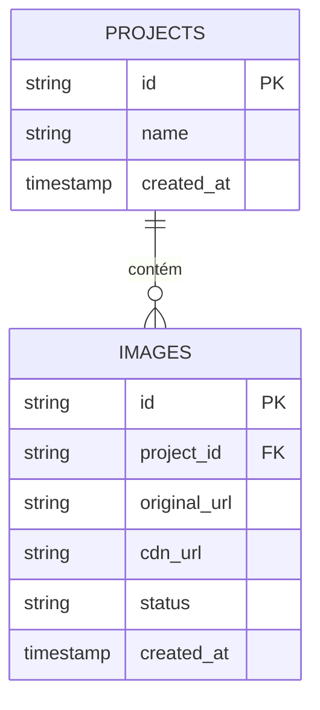

# Relatório de Design e Otimização do Banco de Dados

Este documento detalha a arquitetura do banco de dados para o projeto final, otimizada para consultas de alta frequência.

## Diagrama do Esquema do Banco de Dados

## Escolha do Banco de Dados e Justificativa

### Banco de Dados Primário: PostgreSQL
- **Justificativa:** Para este sistema, a consistência e a integridade dos dados são críticas. O PostgreSQL oferece conformidade ACID robusta, garantindo que os relacionamentos entre projetos e suas imagens processadas nunca sejam corrompidos.

### Camada de Cache: Redis
- **Justificativa:** Para lidar com consultas de alta frequência, acessar o PostgreSQL para cada requisição é ineficiente. O Redis armazena dados acessados com frequência (como listas de projetos e metadados de imagens) na memória RAM, proporcionando tempos de resposta por volta de microssegundos.

## Otimizações para Alta Frequência

### Indexação do Banco de Dados
Implementamos índices B-Tree em colunas usadas em cláusulas `WHERE` e `ORDER BY` frequentes:
- `idx_images_project_id`: Acelera a recuperação de imagens para projetos específicos.
- `idx_projects_created_at`: Otimiza a recuperação dos projetos mais recentes.

### Estratégia de Caching: Cache-Aside
O sistema utiliza o padrão *Cache-Aside*:
1. A aplicação verifica o *Redis* em busca dos dados solicitados.
2. Se encontrado (*Cache Hit*), retorna imediatamente.
3. Se não encontrado (*Cache Miss*), consulta o *PostgreSQL*, popula o *Redis* e retorna.
4. Em operações de escrita (ex: criação de um projeto), o cache é invalidado para garantir a atualização dos dados.

## Considerações de Escalabilidade
- **Read Replicas:** Se o tráfego de leitura exceder a capacidade de uma única instância do PostgreSQL, réplicas de leitura podem ser adicionadas.
- **Particionamento:** Se a tabela `images` crescer para milhões de linhas, ela poderá ser particionada por `created_at` ou `project_id`.