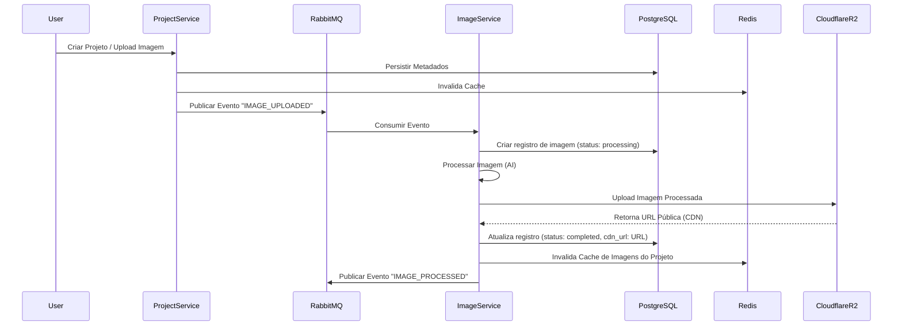

# Relatório de Design: Banco de Dados e CDN

Este documento detalha a arquitetura do banco de dados e a integração com o CDN para o projeto final, otimizados para alta performance e escalabilidade.

## Diagrama de Arquitetura de Dados

## Otimização do Banco de Dados (Alta Frequência)

### PostgreSQL (Persistência)
- **Justificativa:** Garantia de integridade referencial entre Projetos e Imagens através de chaves estrangeiras e conformidade ACID.
- **Otimizações:** Implementação de índices B-Tree nas colunas `project_id` (tabela `images`) e `created_at` (tabela `projects`) para acelerar consultas de leitura frequentes.

### Redis (Cache-Aside)
- **Justificativa:** Redução da carga no PostgreSQL e latência de resposta em microsegundos para dados acessados repetidamente.
- **Fluxo:** O `project-service` consulta o Redis antes do banco. O cache é invalidado em todas as operações de escrita para garantir consistência.

## CDN para Armazenamento de Imagens (Cloudflare R2)

### Escolha da Tecnologia: Cloudflare R2
- **Compatibilidade S3:** Permite o uso de bibliotecas padrão da indústria, facilitando a portabilidade.
- **Egress Fees Zero:** Diferente do AWS S3, o R2 não cobra por transferência de dados de saída, tornando-o ideal para um projeto com muitas visualizações de imagens.
- **Integração Nativa:** Distribuição automática através da rede global da Cloudflare.

### Estratégia de Integração
- **Armazenamento Desacoplado:** O banco de dados PostgreSQL armazena apenas os metadados e a URL final da imagem. O arquivo binário reside exclusivamente no R2.
- **Workflow:** O `image-processing-service` é o único responsável pelo upload para o CDN, garantindo que apenas imagens processadas e validadas ocupem espaço de armazenamento.

## Conclusão
A combinação de PostgreSQL + Redis resolve o desafio de consultas de alta frequência, enquanto o Cloudflare R2 fornece uma solução de storage robusta, segura e de baixo custo para os ativos de mídia do projeto.